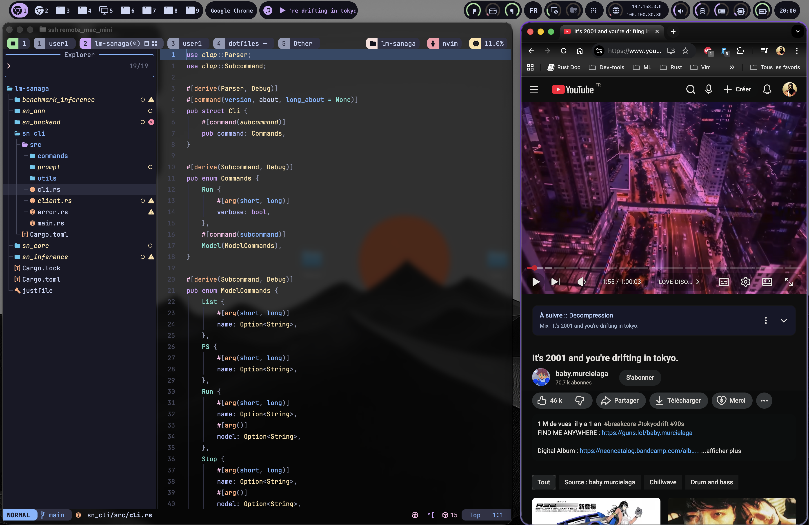

# Armanoide's Personal Dotfiles

My essential, highly customized configuration files, fine-tuned for a productivity-driven workflow on **macOS**.

## 💻 Screenshot

## ✨ Key Components

This repository manages configurations for the following applications:

| Application | Configuration File(s) / Language |
| :--- | :--- |
| **Neovim** | `.config/nvim/` |
| **Leader-key** | `.config/leaker-key/` |
| **Zsh** | `.zshrc`  |
| **tmux** | `.tmux.conf` |
| **Ghostty** | `.config/ghostty/` |
| .local/rbin | (Various binary) |

